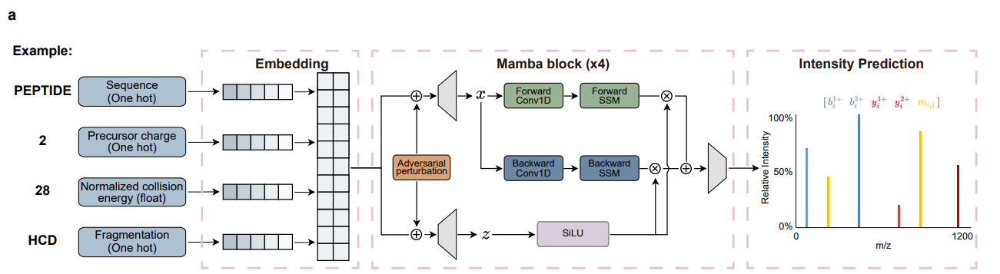
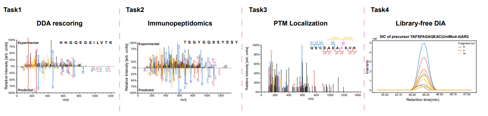

<p align="center">
  
</p>

---

<p align="center">
  <strong>MS2Int leverages internal fragment ions to advance peptide tandem mass spectrum prediction</strong>
</p>

<p align="center">
  
  
  <a href="https://github.com/state-spaces/mamba"></a>
  <a href="https://github.com/cliangX/MS2Int"></a>
  <a href="LICENSE"></a>
</p>
<div align="center">
  🌐 <strong>Web Server</strong>: <a href="https://ms2int.com">ms2int.com</a>
</div>

---

<details>
<summary><strong>Table of Contents</strong></summary>

1. [About The Project](#about-the-project)
   * [Applications](#applications)
2. [Getting Started](#getting-started)
   * [Prerequisites](#prerequisites)
   * [Dependencies](#dependencies)
   * [Installation](#installation)
3. [Usage](#usage)
   * [Inference](#1-inference)
   * [VAT Training / Fine-tuning](#2-vat-training--fine-tuning)
   * [Rescore](#rescore)
   * [MS2Int_flr](#5-ms2int_flr)
   * [Model Weights & Data](#model-weights--data)
4. [Troubleshooting](#troubleshooting)
5. [Citation](#citation)
6. [License](#license)
7. [Contact](#contact)

</details>

---

## About The Project

MS2Int is a deep learning framework that integrates internal fragment ions to enable full-spectrum MS/MS intensity prediction. Built on a bidirectional **Mamba** state space backbone and trained with **Virtual Adversarial Training (VAT)**, MS2Int jointly predicts terminal **b/y** ions and internal **m** ions. Trained on ~7.9 million precursors, MS2Int improves downstream proteomics workflows including DDA rescoring, DIA library search, HLA immunopeptidomics, and phosphosite localization.

<p align="center">
  
</p>

<p align="right">(<a href="#ms2int">back to top</a>)</p>

### Applications

* **DDA rescoring**: Prediction-assisted rescoring for data-dependent acquisition workflows.
* **DIA library search**: Predicted spectra for spectral library construction and DIA searching.
* **HLA immunopeptidomics**: Improved identification and rescoring for immunopeptidomics datasets.
* **Phosphosite localization**: Phosphorylation-site localization support with an FLR QC pipeline.

<p align="center">
  
</p>

<p align="right">(<a href="#ms2int">back to top</a>)</p>

---

## Getting Started

To get MS2Int up and running locally, follow these steps.

### Prerequisites

Ensure you have the following before installation:

* Python 3.10+
* GPU with CUDA support (recommended for training and inference acceleration)
* Conda or Miniconda

### Dependencies

* Python 3.10+
* PyTorch 2.7+ (tested with 2.7.0; see `requirement.txt` or [Installation](#installation))
* mamba-ssm, mamba-ssm2, h5py, numpy, pandas, tqdm, einops


### Installation

#### From Scratch

This script follows a locally validated setup path (install `causal-conv1d` to enable the Mamba2 fast path; Blackwell requires upgrading/restoring Triton):

**Step 1: Create conda environment**
```bash
conda create -n mamba_dev python=3.10 -y
conda activate mamba_dev
```

**Step 2: Install PyTorch 2.7 (cu128)**
```bash
pip install --no-cache-dir torch==2.7.0 --index-url https://download.pytorch.org/whl/cu128
```

**Step 3: Install core dependencies**
```bash
pip install --no-cache-dir numpy ninja packaging
```

**Step 4: Clone and build mamba_ssm**
```bash
git clone https://github.com/state-spaces/mamba.git mamba_src
cd mamba_src
git -c safe.directory="$(pwd)" fetch --tags
git -c safe.directory="$(pwd)" checkout v2.3.0

export CUDA_HOME=/usr/local/cuda-12.8
export PATH="$CUDA_HOME/bin:$PATH"
export LD_LIBRARY_PATH="$CUDA_HOME/lib64:${LD_LIBRARY_PATH:-}"
pip install --no-cache-dir --no-build-isolation .
```

**Step 5: Install causal-conv1d (enable Mamba2 fast path)**
```bash
cd ..
git clone https://github.com/Dao-AILab/causal-conv1d.git causal_conv1d_src
cd causal_conv1d_src
git -c safe.directory="$(pwd)" checkout v1.6.0

# Force source build to avoid ABI mismatch between prebuilt wheels and the current torch version
export CAUSAL_CONV1D_FORCE_BUILD=TRUE
pip install --no-cache-dir --no-build-isolation .
```

**Step 6: Upgrade/restore Triton (for Blackwell support)**
```bash
# Note: installing causal-conv1d may pull triton back to torch-pinned 3.3.0; Blackwell requires a newer version
pip install --no-cache-dir --upgrade --force-reinstall triton==3.6.0
```

**Step 7: Acceptance test**
```python
import torch
from mamba_ssm import Mamba2
batch, length, dim = 2, 64, 16
x = torch.randn(batch, length, dim).to("cuda")
model = Mamba2(d_model=16, d_state=16, d_conv=4, expand=2, headdim=16, use_mem_eff_path=False).to("cuda")
y = model(x)
assert y.shape == x.shape
print("ACCEPTANCE PASS:", y.shape)
```

#### Alternative: Using docker

If you prefer using `docker`:

coming soon

<p align="right">(<a href="#ms2int">back to top</a>)</p>

---

## Usage

### 1) Inference (from MaxQuant)

Generate the MS2Int inference input H5 (including `train_data`) from MaxQuant `msms.txt` and the corresponding `mzML`, then use the model to write `Intpredict`.

**Step 1: Generate inference input H5 from MaxQuant(`data/msms.txt` and `data/mzml/`)**

```sh
python "spectrum_processing/unmodficaiton/run.py" \
  --msms "data/msms.txt" \
  --mzml-dir "data/mzml" \
  --output "data/MS2Int_input.h5"
```

**Step 2: Run MS2Int inference (write predicted intensities into `Intpredict`)**

```sh
python "MS2Int/predict.py" \
  --ckpt "checkpoints/ms2int_cevat/model_epoch_97_val_loss_0.2735_0609_221427.pth" \
  --input "data/MS2Int_input.h5" \
  --output "data/MS2Int_input.h5"
```

**Notes:**

* The `Fragmentation` field (HCD/CID) reported in MaxQuant's msms.txt may be incorrectly extracted, so we extract `Fragmentation` and `collision_energy` directly from the mzML files instead.


### 2) Inference (from CSV/TSV)

**Step 1: Prepare CSV/TSV file with required columns**

**Demo input (`data/demo_input.csv`):**

```csv
Sequence,Length,Charge,collision_energy,Fragmentation
PEPTIDEK,8,2,30,HCD
ALLS[Phospho]LATHK,10,3,27,HCD
[Acetyl]-M[Oxidation]AGLNK,6,2,30,CID
C[Carbamidomethyl]DEFGHIK,8,2,25,HCD
```

**Step 2: Run MS2Int inference (CSV input auto-converted to H5)**

```sh
python "MS2Int/predict.py" \
  --ckpt "checkpoints/ms2int_cevat/model_epoch_97_val_loss_0.2735_0609_221427.pth" \
  --input "data/demo_input.csv" \
  --output "data/demo_output.h5"
```

### 3) Training / Fine-tuning / PTM Fine-tuning

**Prepare training/Fine-tuning data (extract spectra):**

Generate experimental fragment intensities from MaxQuant `msms.txt` and `mzML`:

```sh
python "spectrum_processing/unmodficaiton/run.py" \
  --msms "data/msms.txt" \
  --mzml-dir "data/mzml" \
  --mode unmodified \
  --output "data/training/train.h5"
```

**Training from scratch:**

```sh
python MS2Int/main.py --train_data_path "data/training/train.h5"
```

**Fine-tuning:**

```sh
python MS2Int/fine_tune.py \
  --pth "checkpoints/ms2int_cevat/model_epoch_97_val_loss_0.2735_0609_221427.pth" \
  --train_data_path "data/training/train.h5" \
  --checkpoint_path "checkpoints/" \
  --log_path "logs/train.log"
```

<a id="rescore"></a>

### 4) Rescore

```sh
bash "spectrum_processing/rescore/run_pipeline.sh" \
  "/path/to/WORKDIR" \
  "/path/to/model.pth" \
  "mamba_dev"
```

**Data directory structure:**

```
data/
├── txt/
│   └── msms.txt
└── mzml/
    ├── raw1.mzML
    └── raw2.mzML
```

Output is written to `data/rescore/`; final mokapot results are in `data/rescore/mokapot/`.

### 5) MS2Int_flr

PTM site localization quality control pipeline based on target-decoy spectral similarity and False Localization Rate (FLR) estimation.


**Data directory structure (`data/MS2Int_flr/`):**

```
data/MS2Int_flr/
├── txt/
│   ├── msms.txt                    # MaxQuant search results
│   └── Phospho (STY)Sites.txt      # MaxQuant phosphosite table
└── mzml/
    └── raw1.mzML                   # Raw spectral data
```

**Run the full pipeline:**

```sh
bash MS2Int_FLR/run_pipeline.sh data/MS2Int_flr \
  ptm_finetune/checkpoints/model_epoch_14_val_loss_0.3056_0627_123641.pth
```

The second argument is the MS2Int checkpoint path (required). For phosphoproteomics FLR, use a phosphorylation fine-tuned checkpoint; see [Model Weights & Data](#model-weights--data).

**Output files (in `data/MS2Int_flr/output/`):**

```
output/
├── unique_psm.csv       # Unique PSMs
└── phosphosites.csv     # Final phosphosites at FLR cutoff
```

### Model Weights & Data

Pre-trained model weights are available for download:

| Model | Description | Download |
|-------|-------------|----------|
| MS2Int (Unmodified) | Trained on unmodified peptides (HCD/CID) | [Google Drive](https://drive.google.com/file/d/19njBiyeZweNvtlEI7Mekjp-kDKKKo458/view?usp=drive_link) |
| MS2Int (Phosphorylation) | Fine-tuned for phosphopeptides | [Google Drive](https://drive.google.com/file/d/1A58kc1555622lbqsMI-Zg-kT7GoHhkS5/view?usp=drive_link) |


<p align="right">(<a href="#ms2int">back to top</a>)</p>

---

## Troubleshooting

### Common Issues

**Environment / Dependencies**

* **mamba-ssm / causal-conv1d build issues**: If compilation fails with `SSLEOFError` or network timeouts, repeat the pip install command - pip will auto-retry. If you need `causal-conv1d` (to enable the Mamba2 fast path), it is recommended to compile and install from source following Step 5 in [Installation](#installation) (`CAUSAL_CONV1D_FORCE_BUILD=TRUE` + `--no-build-isolation`) to avoid ABI mismatch between prebuilt wheels and the current torch version. Also note it may pull triton back to 3.3.0; Blackwell requires reinstalling `triton==3.6.0`. You can also skip `causal-conv1d` entirely (MS2Int is compatible with `use_mem_eff_path=False`).

* **Git safe.directory error**: If you see `fatal: detected dubious ownership in repository`, use `git -c safe.directory="$(pwd)"` prefix for fetch/checkout commands, or add the directory to git safe directories.

* **Mamba2 headdim assertion error**: If you get `AssertionError: assert self.d_ssm % self.headdim == 0`, ensure `headdim` divides `d_inner` evenly. For `d_model=16, expand=2`, use `headdim=16` (since `d_inner = 32`).

* **Triton not supported on Blackwell**: If you see `computeCapability not supported' failed` with `target=cuda:120`, upgrade Triton: `pip install --upgrade --force-reinstall triton==3.6.0`. This conflicts with PyTorch's triton==3.3.0 dependency but is necessary for Blackwell GPUs.

* **CUDA version mismatch**: When both CUDA 12.8 and 13.0 exist, explicitly set `CUDA_HOME=/usr/local/cuda-12.8` (PyTorch 2.7 wheels use CUDA 12.8) before building mamba_ssm.

* **FLR pipeline Step3**: Requires `pyopenms`, install separately via `conda install -c conda-forge pyopenms`.

**Inference / Training**

* **All-zero intensities**: During inference, samples with intensity all zeros likely exceed the maximum supported peptide length (≤40 amino acids) or contain unsupported modification tokens.

* **Out of Memory (OOM)**: Reduce batch size.


<p align="right">(<a href="#ms2int">back to top</a>)</p>

---

## Citation

**Coming soon.** The manuscript is currently under review. Citation information will be updated upon publication.

<p align="right">(<a href="#ms2int">back to top</a>)</p>

---

## License

Distributed under the MIT License. See [LICENSE](LICENSE) for more information.

<p align="right">(<a href="#ms2int">back to top</a>)</p>

---

## Contact

Project Link: [https://github.com/cliangX/MS2Int](https://github.com/cliangX/MS2Int)

<p align="right">(<a href="#ms2int">back to top</a>)</p>
